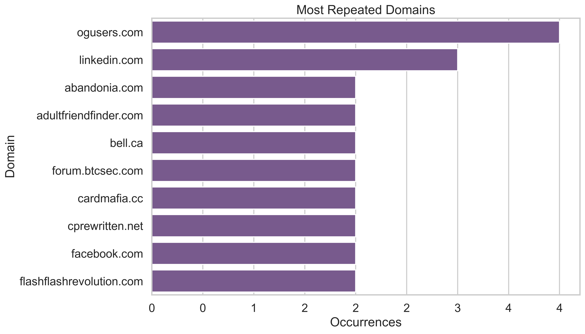
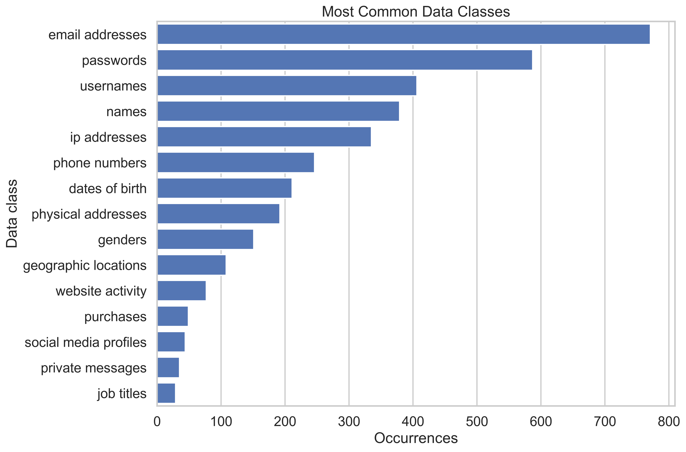
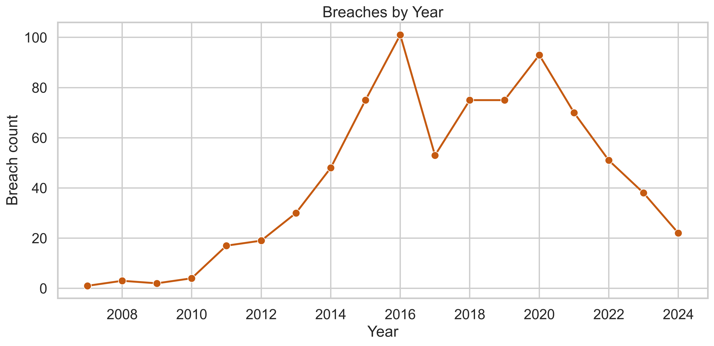

# 🛡️ Cyber Breach Analysis


Exploratory Data Analysis (EDA) project that investigates historical cybersecurity breach data using Python and Pandas.

This project aims to uncover patterns in breached services, exposed information, domain distributions, and historical breach trends while demonstrating practical data analysis workflows.

---

# 📌 Project Objectives

* Understand the structure of cybersecurity breach datasets.
* Perform data cleaning and preprocessing.
* Analyze breach trends and exposed information.
* Create meaningful visualizations.
* Build a portfolio-ready data analysis project combining cybersecurity and data analytics.

---

# 📂 Dataset Information

Dataset:

`data/raw/breached_services_info.csv`

### Dataset Summary

| Metric           | Value                |
| ---------------- | -------------------- |
| Total Records    | 777                  |
| Unique Services  | 777                  |
| Unique Domains   | 720                  |
| Largest Breach   | 772,904,991 accounts |
| Peak Breach Year | 2016                 |

---

# 🛠️ Technologies Used

* Python
* Pandas
* NumPy
* Matplotlib
* Seaborn
* Jupyter Notebook

---

# 📁 Project Structure

```text
cyber-breach-analysis
│
├── data/
│   ├── raw/
│   └── processed/
│
├── images/
├── notebooks/
├── reports/
├── scripts/
│
├── README.md
├── requirements.txt
└── TASKS.md
```

---

# 🔄 Project Workflow

```text
Raw Dataset
      ↓
Data Understanding
      ↓
Data Cleaning
      ↓
Exploratory Analysis
      ↓
Visualization
      ↓
Insights & Reporting
```

---

# 📓 Notebooks

| Notebook                      | Description                                |
| ----------------------------- | ------------------------------------------ |
| 01_data_understanding.ipynb   | Initial exploration and dataset inspection |
| 02_data_cleaning.ipynb        | Data preprocessing and cleaning            |
| 03_exploratory_analysis.ipynb | Statistical analysis and insights          |
| 04_visualization.ipynb        | Charts and visual exploration              |

---

# 📊 Visualizations

## Top Domains



---

## Category Distribution



---

## Breach Distribution by Year



---

# 🔍 Key Findings

### 📧 Exposed Information

Email addresses are the most frequently leaked data type, followed by passwords and usernames.

### 📈 Historical Trends

The dataset shows a significant concentration of breaches around 2016.

### 🚨 Large-Scale Incidents

The largest breach affected more than **772 million accounts**, demonstrating the massive scale cyber incidents can reach.

### 🌐 Domain Repetition

Certain domains repeatedly appear in breach records, indicating recurring targets or communities.

---

# 🧠 Skills Demonstrated

### Data Analysis

* Data Cleaning
* Exploratory Data Analysis (EDA)
* Statistical Summarization
* Data Visualization

### Python

* Pandas
* NumPy
* Matplotlib
* Modular Python Scripts

### Cybersecurity Domain Knowledge

* Breach Dataset Interpretation
* Exposed Data Classification
* Threat Trend Analysis

---

# 🚀 How To Run

Install dependencies:

```bash
pip install -r requirements.txt
```

Run scripts:

```bash
python -m scripts.cleaning
python -m scripts.analysis
python -m scripts.visualization
```

Open notebooks sequentially:

1. 01_data_understanding.ipynb
2. 02_data_cleaning.ipynb
3. 03_exploratory_analysis.ipynb
4. 04_visualization.ipynb

---

# 📄 Reports

* `reports/findings.md`
* `reports/executive_summary.md`

---

# 🔮 Future Improvements

* Interactive dashboard with Streamlit
* Plotly visualizations
* Automated ETL pipeline
* Additional breach datasets integration
* Threat Intelligence Dashboard

---

# 👨‍💻 Author

Created as a portfolio project to combine:

**Python + Pandas + Data Analysis + Cybersecurity**
